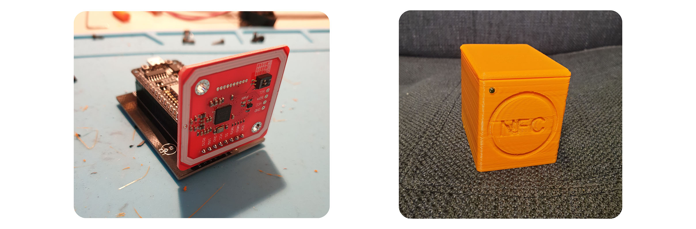
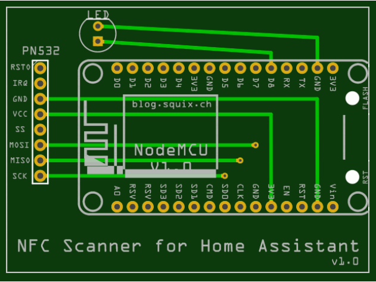
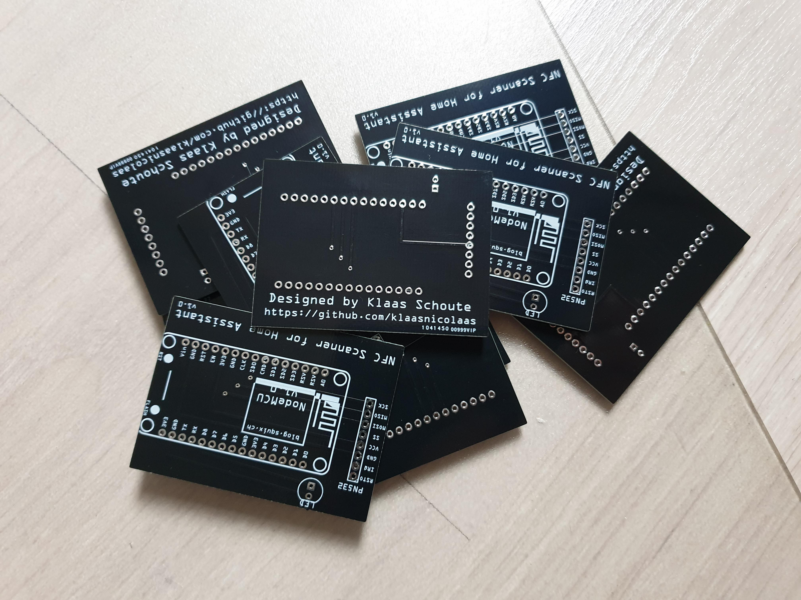

# NFC Scanner :mag: for Home Assistant :house:



## About

Imagine that you could start or stop everything with a NFC tag in Home Assistant :smile: Every time you hold an NFC tag against the scanner (and the UID of it is included in the list), there will be send an MQTT message to your broker and eventually to Home Assistant. With a LED you also get physical feedback, that the scanner has actually recognized your Tag.

For the NFC scanner I designed a circuit board (PCB) and a 3D printed case.

- In the `case` folder you will find the required STL files.
- In the `pcb` folder you can find the Gerber files. Many people let their boards made by [Seeedstudio](https://www.seeedstudio.com/fusion_pcb.html) in Shenzhen.

If you have suggestions or questions, open an **issue** or contribute via a **PR**!

### Schematic

Requirements:

- PN532 NFC RFID (Elechouse module v3)
- ESP8266 (NodeMCU v1.0)

| NFC reader | NodeMCU / ESP8266  |
|------------|--------------------|
| SS (CS)    | D2 (GPIO4)         |
| SCK        | D5 (GPIO14)        |
| MISO       | D6 (GPIO12)        |
| MOSI       | D7 (GPIO13)        |
| VCC        | VCC (3V3)          |
| GND        | GND                |

## How to setup

- You need Arduino IDE to configure some files, and use the serial monitor (other IDE's are okey).
- You need the `PN532`, `PubSubClient`, `SPI` and `ESP8266WiFi` library.

Further down this page you will find all information about which adjustments you have to make.

### NFC Tags

At `NUM_ACCEPTED_UIDS` you indicate how many NFC tags/cards you will use. Then enter the `UID` values of your NFC tags/cards and give each tag/card its own name. If you are going to make multiple nfc scanners, you can indicate in which room the scanner is present with the `LOCATION` variable.

```C++
#define NUM_ACCEPTED_UIDS 2 //<-----------------CHANGE THIS IF ADDING CARDS!!
NFCTag NFCTags[NUM_ACCEPTED_UIDS] = {
  // It is neccessary to account for UID length since a 7 byte ID could contain a 4 byte ID, which would cause a misfire
 //  #0    #1    #2    #3    #4    #5    #6   #Tagname
  {{0x00, 0x00, 0x00, 0x00, 0x00, 0x00, 0x00}, "Tag1", false, 0, false, {0}},
  {{0x00, 0x00, 0x00, 0x00, 0x00, 0x00, 0x00}, "Tag2", false, 0, false, {0}},
};

// Location of the NFC scanner
#define LOCATION "living_room"
```

#### Finding the UIDs

You can find your `UID` value in different ways, such as via your phone through certain apps from the app / play store. But to make it easy for yourself, it is possible to read only the UID tags / cards, via the same .ino script.

You start this mode by setting `readUIDMode` to true, in the **`ha_nfc_scanner.ino`** file.

```C++
// False wil start de main function, True will start the UID read script so you can find out wich UID's your NFC tags have on the serial monitor.
bool readUIDMode = true;
```

This way the MQTT and WIFI are switched off and you can read your UID values using the serial monitor.

### Credentials

Enter the details of your Wi-Fi network and login details of your MQTT client account and the IP address of the MQTT broker.

```c++
// Wi-Fi credentials
#define WIFI_SSID     ""
#define WIFI_PASSWORD ""

// MQTT
#define MQTT_USERNAME     ""
#define MQTT_PASSWORD     ""
#define MQTT_SERVER       ""
#define MQTT_SERVER_PORT  1883
```

### Home Assistant - Binary Sensor

in Home Assistant we can create a binary sensor that will respond when a tag is recognized and is in the UID list.

To retrieve and use the results obtained with the NFC scanner into Home Assistant, please edit and add this snippet into your configuration. Make sure to replace `<CHIP_ID`, `<LOCATION>` and `<NFC_TAG_NAME>` with the values defined in `config.h`.

```yaml
# Example configuration.yaml entry
binary_sensor:
  - platform: mqtt
    name: 'NFC Tag 1'
    state_topic: '<CHIP_ID>/sensor/<LOCATION>/<NFC_TAG_NAME>/state'
    availability_topic: '<CHIP_ID>/availability'
  - platform: mqtt
    name: 'NFC Tag 2'
    state_topic: '<CHIP_ID>/sensor/<LOCATION>/<NFC_TAG_NAME>/state'
    availability_topic: '<CHIP_ID>/availability'
```

### PCB Design

Do you live in the Netherlands and you want a PCB? Contact me I have number of PCB's.



## Credits

A big :star: for [mertenats](https://github.com/mertenats/Open-Home-Automation), the script of this repo is based on his.

[scanner-stack]: /img/nfc-scanner-stack.jpg